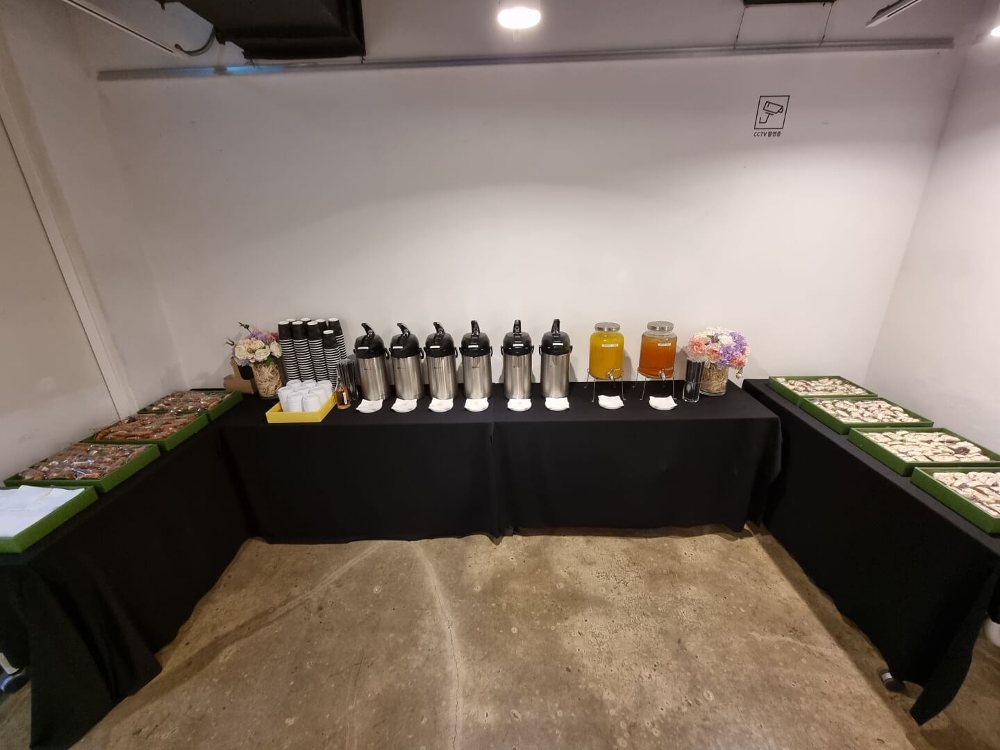
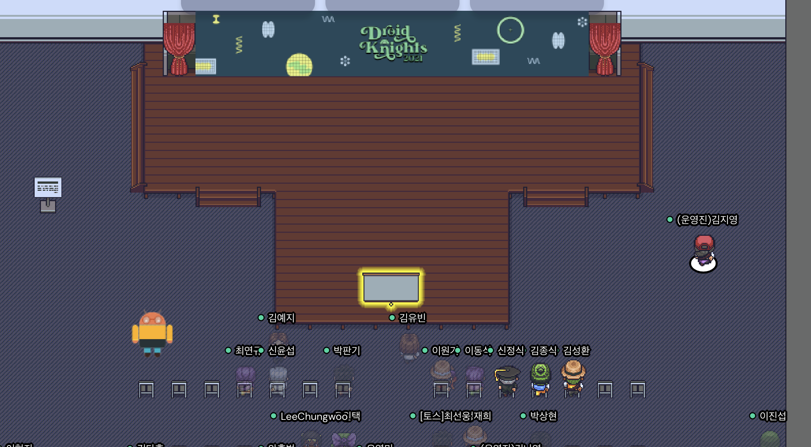
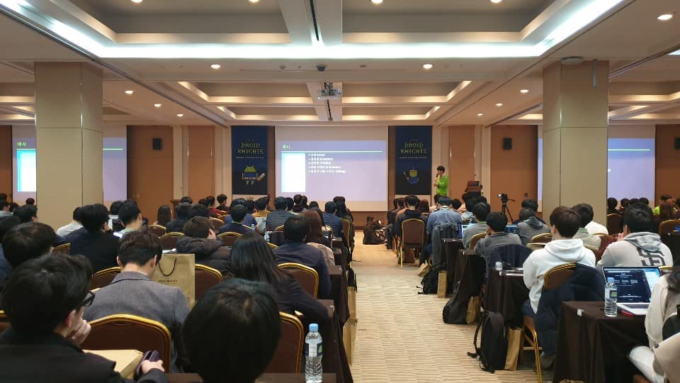
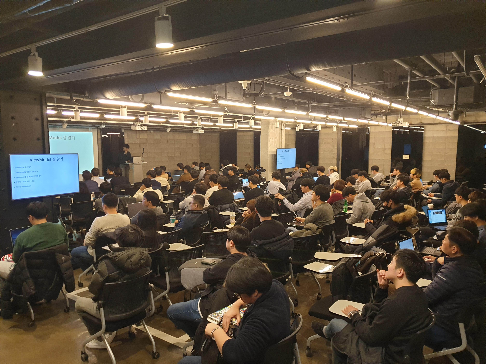
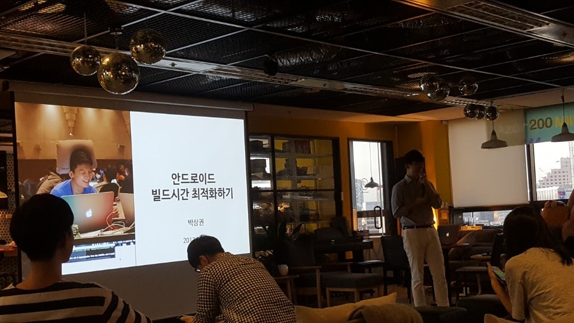

# 행사 기획
### 18. DroidKnights 2024
https://festa.io/events/4990
https://www.youtube.com/watch?v=xsAI6jvI3xk
- 일시: 2024.06.11
- 장소: 코엑스 컨퍼런스 E룸
- 참가인원: 750명

### 17. [안드로이드 컨퍼런스] Native vs Flutter 그리고 KMP
https://event-us.kr/ted/event/79581
- 일시: 2024.04.06
- 장소: 마루180
- 참가인원: 150명

### 16. DroidKnights 2023
https://festa.io/events/3635
- 일시: 2023.09.12
- 장소: 코엑스 컨퍼런스 E룸
- 참가인원: 700명

### 15. [개발자 컨퍼런스] 주니어 개발자? Super 주니어 개발자!
https://event-us.kr/ted/event/45142
- 일시: 2022.07.30
- 장소: 마루180
- 참가인원: 150명

### 14. [안드로이드 컨퍼런스] 코로나시대의 안드로이드 개발자들
https://event-us.kr/ted/event/43225
- 일시: 2022.05.14
- 장소: 마루180
- 참가인원: 150명

### 13. DroidKnights 2021
https://sites.google.com/view/dk21/
- 일시: 2021.09.25
- 장소: 온라인 스트리밍

### 12. DroidKnights 2020
https://droidknights.github.io/2020/
https://www.wanted.co.kr/events/droidknights2020
- [행사영상](https://www.youtube.com/c/DroidKnights/videos)
- 일시: 2020.09.05
- 장소: 온라인 스트리밍

### 11. [개발자 컨퍼런스]슬기로운 개발생활
https://event-us.kr/ted/event/9635
- 일시: 2019.09.07
- 장소: 마루180
- 참가인원: 120명

### 10. [안드로이드 컨퍼런스]우리 회사는 이렇게 개발해요
https://event-us.kr/ted/event/8421
- 일시: 2019.08.04
- 장소: 마루180
- 참가인원: 150명

### 9. DroidKnights 2019
https://droidknights.github.io/2019/
https://event-us.kr/droidknights/event/5483
- [행사영상](https://youtu.be/tbuG1xbEHkw)
- 일시: 2019.04.05
- 장소: 코엑스
- 참가인원: 700명

### 8. [안드로이드 컨퍼런스]우리는 안드로이드 개발자입니다
https://event-us.kr/ted/event/3700
- 일시: 2018.11.25
- 장소: 마루180
- 참가인원: 150명

### 7. [마케팅 컨퍼런스]우리는 마케터입니다
https://event-us.kr/ted/event/3037
- [행사영상](https://www.youtube.com/watch?v=5f2GG5USZls)
- 일시: 2018.10.03
- 장소: 마루180
- 참가인원: 150명

### 6. [개발자 컨퍼런스]우리는 개발자입니다
https://event-us.kr/ted/event/2421
- 일시: 2018.07.29
- 장소: 마루180
- 참가인원: 150명

### 5. 개인앱 컨퍼런스
https://event-us.kr/ted/event/2350
- 일시: 2018.06.23
- 장소: 마루180
- 참가인원: 150명

### 4. 안드로이드 개발자 모임
https://www.onoffmix.com/event/112228
- 일시: 2017.09.23
- 장소: 하이퍼커넥트
- 참가인원: 60명

### 3. 개인앱 개발자 모임
https://www.onoffmix.com/event/108191
- 일시: 2017.08.12
- 장소: 토즈 강남토즈타워
- 참가인원: 60명

### 2. [안드로이드 개발 Q&A및 팁]오픈채팅방 모임
https://www.onoffmix.com/event/96539
- 일시: 2017.04.29
- 장소: 토즈 강남2호점
- 참가인원: 44명

### 1. 안드로이드 개발자 모임
https://www.onoffmix.com/event/75344
- 일시: 2016.08.24
- 장소: 토즈 강남2호점
- 참가인원: 25명
