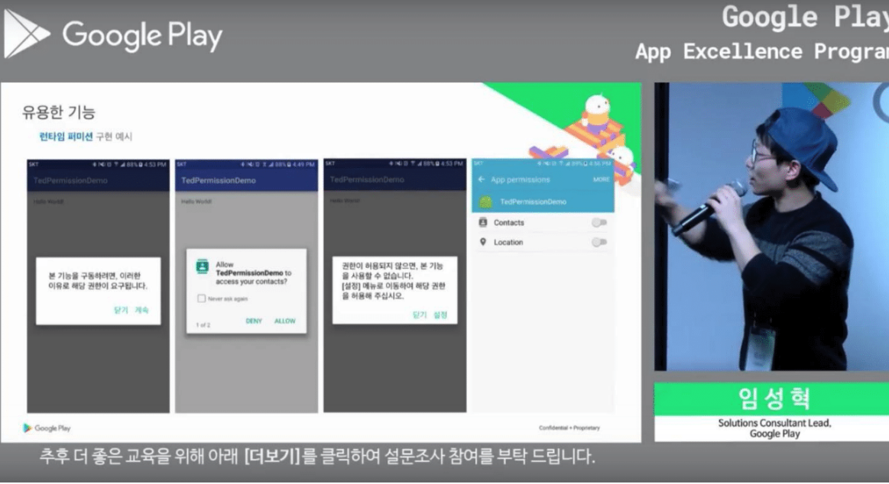

# 깃헙
https://github.com/ParkSangGwon

## 순위
- [대한민국 Java 개발자 2위](http://git-awards.com/users?country=south+korea&language=java)
- [대한민국 Kotlin 개발자 5위](http://git-awards.com/users?country=south+korea&language=kotlin)

## TedPermission
https://github.com/ParkSangGwon/TedPermission
- Easy check permission library for Android Marshmallow
- 

## TedNaverMapClustering
https://github.com/ParkSangGwon/TedNaverMapClustering
- 네이버지도용 클러스터 유틸리티 라이브러리
- 

 .  

## TedImagePicker
https://github.com/ParkSangGwon/TedImagePicker
- TedImagePicker is simple/beautiful/smart image picker
- 

 .  

## TedBottomPicker
https://github.com/ParkSangGwon/TedBottomPicker
- TedBottomPicker is simple image picker using bottom sheet
- 

 .  

## TedKeyboardObserver
https://github.com/ParkSangGwon/TedKeyboardObserver
- TedKeyboardObserver is keyboard's visibility observer
- 

## TedRxOnActivityResult
https://github.com/ParkSangGwon/TedRxOnActivityResult
- StartActivityForResult() / OnActivityResult() using RxJava
- 

## TedPicker
https://github.com/ParkSangGwon/TedPicker
- Multiple image select library for Android. Take a picture or Select from gallary
- 

## TedAdHelper
https://github.com/ParkSangGwon/TedAdHelper
- [Android]Mediation advertise helper for ADMOB,FACEBOOK - Support Native, Banner, Backpress Dialog, Front AD
- 

## TedAdmobDialog
https://github.com/ParkSangGwon/TedAdmobDialog
- [Android]BackPress Ad Dialog for Admob
- 
