# 멘토링

## 부스트캠프
```
SW개발 전문가로서의 역량을 강화할 수 있는 집중 실무 프로그램입니다.
현업 SW개발 전문가들의 업무 경험을 단기간에 압축적으로 제공하고, 심도 깊은 실습 프로젝트와
전문가 멘토링을 통해 신입개발자로서의 역량 강화를 돕습니다.
```
프로그램 기획 총괄, 메인 튜터
- 2018.11 ~ 2018.02
- [프로그램 소개](http://boostcamp.connect.or.kr/)
- [부스트캠프 메인 튜터 소개](https://m.post.naver.com/viewer/postView.nhn?volumeNo=17296366&memberNo=34635212)

## AT EDUCOM 2017
```
장애인을 위한 따뜻한 앱개발 Assistive Technology Education & Competition
```
퍼실리테이터: 전체 행사 기획 및 사회, 멘토링
- 2016.12 ~ 2017.08
- [프로젝트 영상](https://www.youtube.com/watch?v=PUnJHa1_9Zo)
- 참여단체: 서울대, LG전자, 스타트업캠퍼스
- [Project Course](https://gstartupcampus.or.kr/kwa-419658-1)
- ['LG전자, 장애인용 모바일 앱 개발 '따뜻한 기술 나눔'](http://www.fnnews.com/news/201704171951025142)

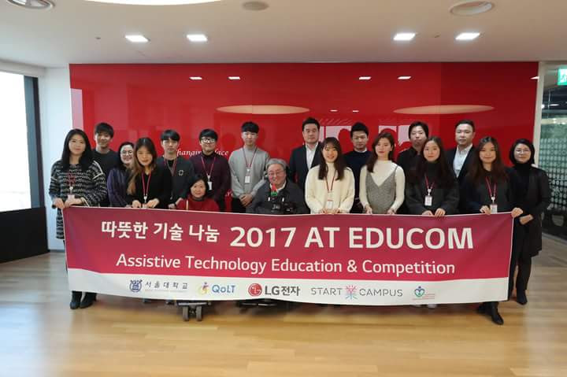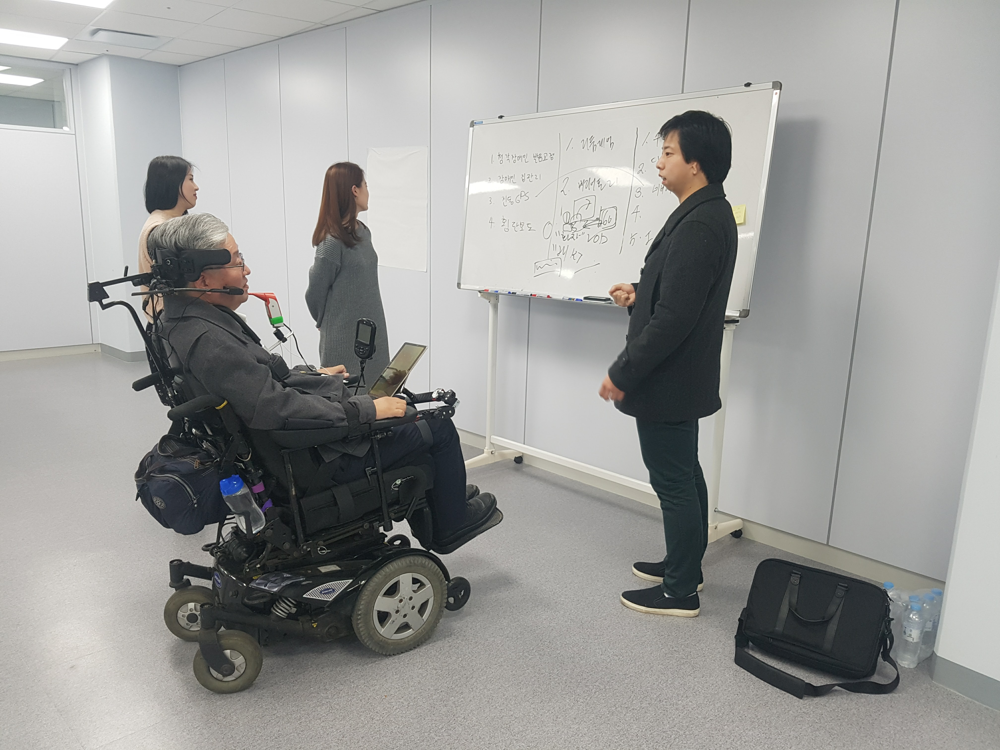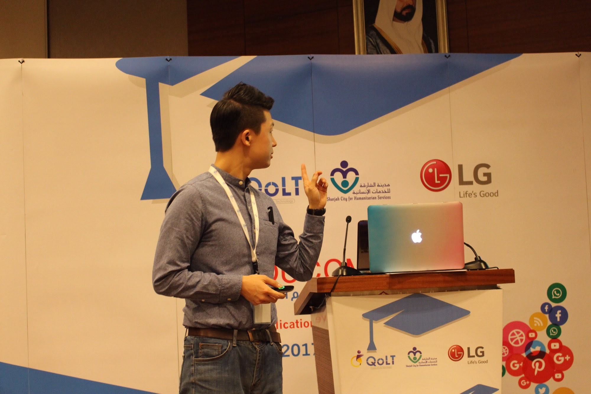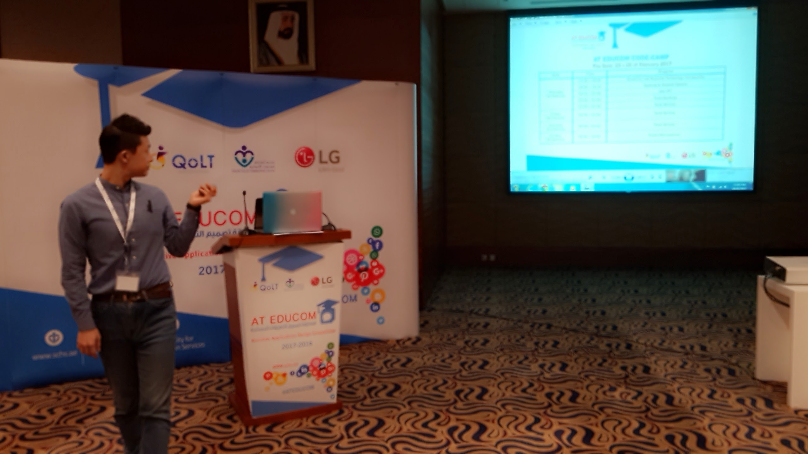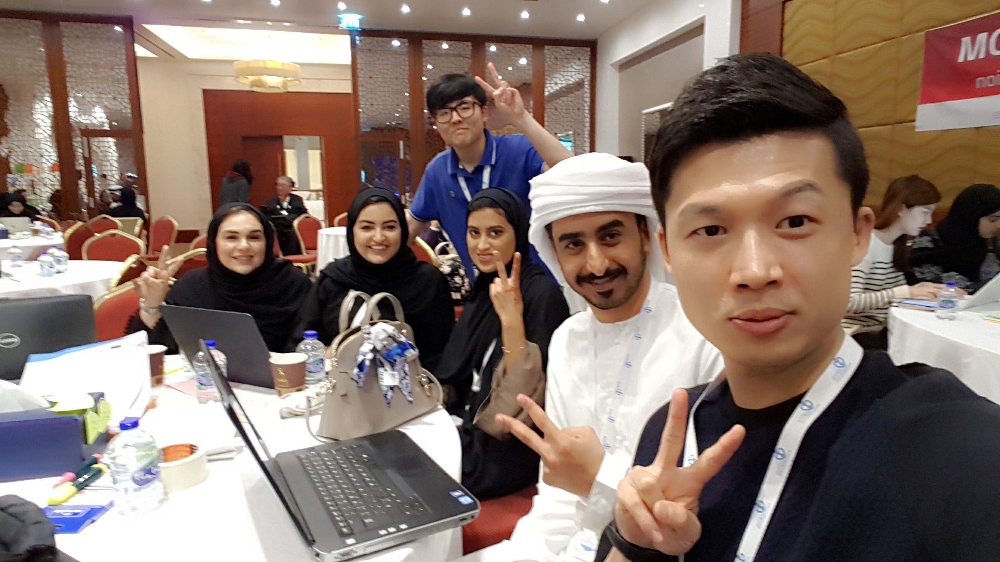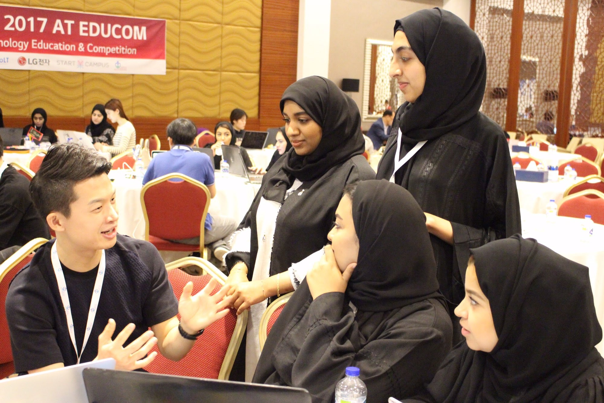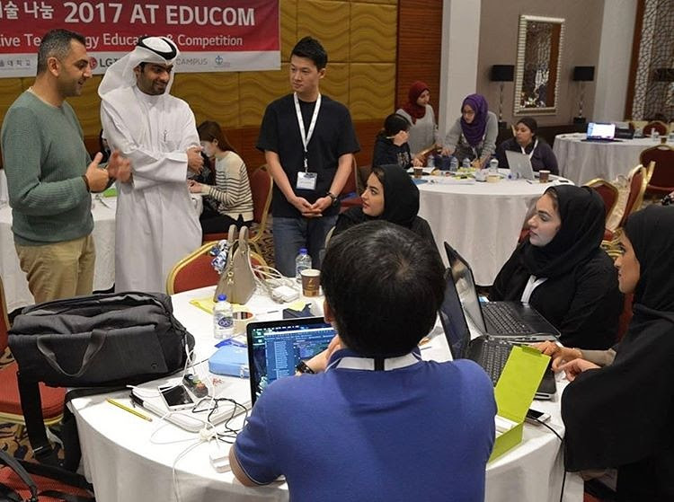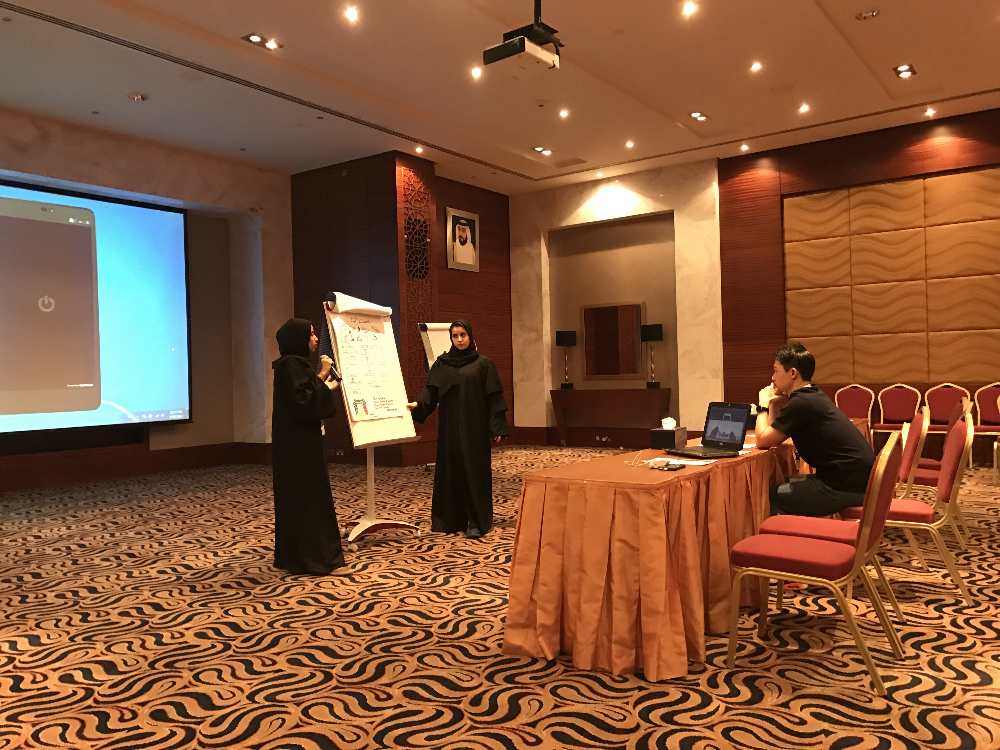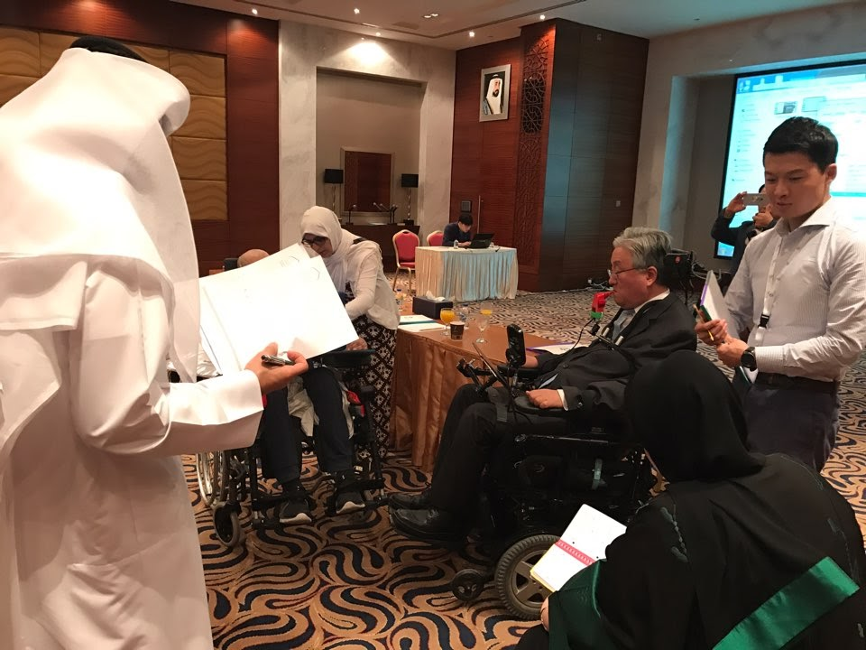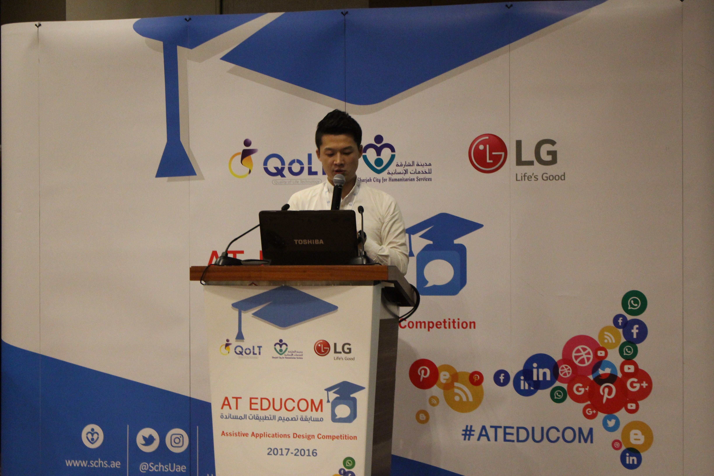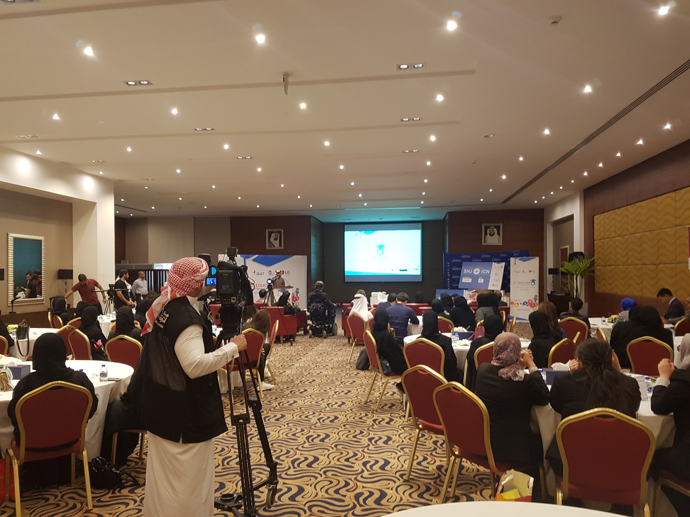
